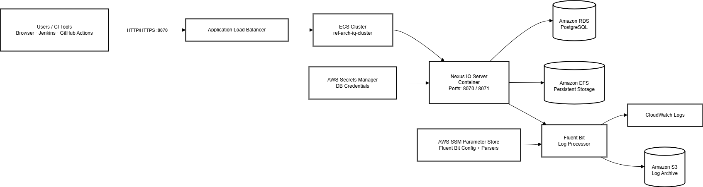

# Sonatype IQ - AWS Cloud-Native (Single Instance)

This directory contains Terraform configuration for deploying a **single-instance** Sonatype IQ Server on AWS using ECS Fargate.

## Architecture

## Deployment Guide

### Step 1: Prerequisites

#### Required Tools
Install these tools on your local machine:

| Tool | Version | Installation | Purpose |
|------|---------|--------------|---------|
| **Terraform** | >= 1.0 | [Install Guide](https://developer.hashicorp.com/terraform/install) | Infrastructure as Code |
| **AWS CLI** | >= 2.0 | [Install Guide](https://docs.aws.amazon.com/cli/latest/userguide/getting-started-install.html) | AWS API access |
| **aws-vault** | Latest | [Install Guide](https://github.com/99designs/aws-vault#installing) | Secure credential management |

#### AWS Account Requirements
- AWS account with administrative access (or sufficient permissions listed below)
- IAM user with MFA enabled
- Ability to create: VPC, ECS, RDS, EFS, ALB, IAM roles

#### Required AWS Permissions
Your IAM user/role needs these AWS service permissions:
- **EC2**: VPC, subnets, security groups, network interfaces
- **ECS**: Clusters, task definitions, services
- **RDS**: Database instances, subnet groups, parameter groups
- **EFS**: File systems, mount targets, access points
- **ELB**: Application Load Balancers, target groups, listeners
- **IAM**: Roles, policies, instance profiles
- **Logs**: CloudWatch log groups
- **Secrets Manager**: Secrets creation and management
- **S3**: Terraform state storage (if using remote state)

### Step 2: Configure AWS Credentials

**The provided scripts use aws-vault for secure credential management.**

1. **Choose a profile name** (e.g., `nexus-iq-deployment`)

2. **Configure your AWS profile in `~/.aws/config`:**
   ```ini
   [profile nexus-iq-deployment]
   region = us-east-1
   output = json
   mfa_serial = arn:aws:iam::<YOUR_ACCOUNT_ID>:mfa/<YOUR-USERNAME>
   ```

3. **Add credentials to aws-vault and test:**
   ```bash
   aws-vault add nexus-iq-deployment
   ```
   Enter your AWS Access Key ID and Secret Access Key when prompted

   ```bash
   aws-vault exec nexus-iq-deployment -- aws sts get-caller-identity
   ```
   You should see your AWS account details.

4. **Set the AWS_PROFILE environment variable:**

   The scripts require the `AWS_PROFILE` environment variable to be set:

   Option 1: Export for your entire session
   ```bash
   export AWS_PROFILE=nexus-iq-deployment
   export AWS_REGION=us-east-1  # Optional: override default region
   ```

   Option 2: Set inline for a single command
   ```bash
   AWS_PROFILE=nexus-iq-deployment <script>
   ```

### Step 3: Configure Terraform Variables

1. **Copy the example configuration:**
   ```bash
   cd /path/to/sca-example-terraform/infra-aws
   cp terraform.tfvars.example terraform.tfvars
   ```

2. **Edit `terraform.tfvars` with your values (or leave to get started quickly):**
   ```bash
   vi terraform.tfvars
   ```

### Step 4: Deploy Infrastructure

1. **Initialize Terraform:**
   ```bash
   terraform init
   ```

   This downloads required providers (AWS, etc.)

2. **Review the deployment plan:**
   ```bash
   terraform init plan
   ```

   This shows what resources will be created without actually deploying them.

3. **Deploy the infrastructure:**
   ```bash
   terraform apply
   ```

   The script will display the application URL when complete.

### Step 5: Access Sonatype IQ Server

1. **Wait for service to be ready:**
   - Initial startup can take 5-10 minutes
   - Database migrations, if needed, run on first boot

2. **Access the web UI:**

   Use the application URL displayed at the end of the deployment.

   Example: `http://ref-arch-iq-alb-123456789.us-east-1.elb.amazonaws.com`

3. **Login credentials:**
   - **Username:** `admin`
   - **Password:** `admin123` (change immediately!)

---

## Teardown / Cleanup

**WARNING: This will delete ALL infrastructure and data!**

1. **Destroy all resources:**
   ```bash
   ./tf-destroy.sh
   ```

   > **Keep the terminal open** - If you close it mid-destroy, the process will potentially stop and leave resources partially deleted.

---

## Configuration

### Configuration Variables

Edit `terraform.tfvars` to customize your deployment:

```hcl
# General Configuration
aws_region  = "ap-south-1"

# Network Configuration
vpc_cidr               = "10.0.0.0/16"
public_subnet_cidrs    = ["10.0.1.0/24", "10.0.2.0/24"]
private_subnet_cidrs   = ["10.0.10.0/24", "10.0.20.0/24"]
db_subnet_cidrs        = ["10.0.30.0/24", "10.0.40.0/24"]

# ECS Configuration
ecs_cpu           = 8192  # 8 vCPU
ecs_memory        = 32768 # 32 GB
iq_desired_count  = 1 # Single instance
iq_docker_image   = "sonatype/nexus-iq-server:latest"
java_opts         = "-Xms24g -Xmx24g -XX:+UseG1GC -Djava.util.prefs.userRoot=/sonatype-work/javaprefs"

# Database Configuration
db_name                     = "nexusiq"
db_username                 = "nexusiq"
db_password                 = "YourSecurePassword123!"  # Change this!
db_instance_class           = "db.r6g.4xlarge"
db_allocated_storage        = 500
db_max_allocated_storage    = 1000
postgres_version            = "15.10"
db_backup_retention_period  = 7
db_backup_window           = "03:00-04:00"
db_maintenance_window      = "sun:04:00-sun:05:00"
db_skip_final_snapshot     = true
db_deletion_protection     = false

# Load Balancer Configuration
# ssl_certificate_arn = "arn:aws:acm:us-east-1:123456789012:certificate/12345678-1234-1234-1234-123456789012"
alb_deletion_protection = false

# Logging Configuration
log_retention_days = 30
```

**Important Settings:**
- **`iq_desired_count = 1`** - Keep this at 1. Only use a single Sonatype IQ Server instance
- **`db_password`** - Use a strong, unique password (required change)
- **`db_deletion_protection = false`** - Set to `true` for production to prevent accidental database deletion
- **`db_skip_final_snapshot = true`** - Set to `false` for production to create a final backup snapshot before database deletion
- **`alb_deletion_protection = false`** - Set to `true` for production use
- **Resource Names** - All AWS resources are prefixed with "ref-arch" (e.g., "ref-arch-iq-cluster")

## Security Features

- **VPC Isolation**: Application runs in private subnets
- **Database Security**: RDS in isolated database subnets
- **Secrets Management**: Database credentials stored in AWS Secrets Manager
- **Encryption**:
  - EFS encrypted at rest and in transit
  - RDS encrypted at rest
  - S3 ALB logs encrypted
- **Security Groups**: Least-privilege network access

## Reliability and Backup

This is a **single instance** deployment.
- **Single Instance**: One ECS Fargate task running Sonatype IQ Server (runs in one AZ at a time)
- **Single AZ Database**: RDS instance runs in one availability zone (no multi-AZ failover)
- **Multi-AZ Infrastructure**: Supporting resources (ALB, subnets, NAT gateways) span 2 availability zones for infrastructure resilience
- **Automatic Restart**: ECS automatically restarts the container if it fails (may restart in different AZ, causing brief downtime)
- **Database Backups**: Automated RDS backups with 7-day retention (configurable)
- **EFS Persistence**: Application data stored on EFS survives container restarts

## Monitoring and Logging

This deployment includes **production-grade logging** with a unified CloudWatch approach:

### Structured Logging with Fluent Bit
- **Fluent Bit Sidecar**: Lightweight log processor running alongside IQ Server
- **5 Log Types Collected**: Application, request, audit, policy-violation, stderr
- **Aggregated to One CloudWatch Log Group**: All logs sent to `/ecs/ref-arch-nexus-iq-server`
- **Separated by Stream Prefix**: Each log type has its own stream prefix for easy filtering
- **Dual Output**: Logs written to both CloudWatch AND EFS for persistence

### CloudWatch Unified Log Group
- **Log Group**: `/ecs/ref-arch-nexus-iq-server`
- **Log Streams** (organized by prefix):
  - `application/` - Main IQ Server logs with multiline parsing
  - `request/` - HTTP request logs with field extraction
  - `audit/` - Audit events (JSON format)
  - `policy-violation/` - Policy violations (JSON format)
  - `stderr/` - System.err output for debugging
  - `fluent-bit/` - Fluent Bit internal logs

### EFS Aggregated Logs
- **Location**: `/var/log/nexus-iq-server/aggregated/`
- **Format**: JSON with ECS metadata enrichment

### Additional Monitoring
- **Container Insights**: ECS cluster monitoring enabled
- **RDS Enhanced Monitoring**: Database performance metrics
- **ALB Access Logs**: Load balancer access logs stored in S3

## Persistent Storage

- **EFS File System**: Shared storage for `/sonatype-work` directory
- **Database**: PostgreSQL RDS for application data
- **Auto-scaling Storage**: RDS storage scales automatically up to configured limit

## Networking

### Subnets
- **Public Subnets**: Load balancer and NAT gateway
- **Private Subnets**: ECS Fargate tasks
- **Database Subnets**: RDS instance (no internet access)

### Security Groups
- **ALB**: Allows HTTP (80) and HTTPS (443) from internet
- **ECS**: Allows traffic from ALB on port 8070
- **RDS**: Allows PostgreSQL (5432) from ECS tasks only
- **EFS**: Allows NFS (2049) from ECS tasks only

